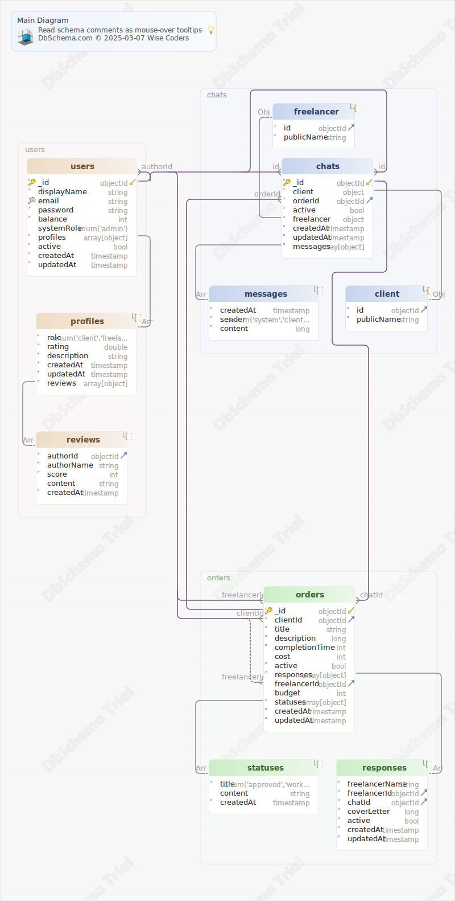

# Диаграмма
Generated using [DbSchema](https://dbschema.com)

### Схема

### Коллекция chats 
Коллекция переписок (чатов).

|Idx |Name |Data Type |Description |
|---|---|---|---|
| * &#128273;  &#11019; | \_id| objectId  |  |
| * | client| object  | Информация о заказчике (одном из участников переписки). |
| * &#11016; | client.id| objectId  | ID заказчика. |
| * | client.publicName| string  | Публичное имя заказчика. |
| * &#11016; | orderId| objectId  | ID заказа, по которому ведётся переписка. |
| * | active| bool  DEFAULT true | Активная ли переписка, можно ли отправлять новые сообщения. |
| * | freelancer| object  | Информация об исполнителе (одном из участников переписки). |
| * &#11016; | freelancer.id| objectId  | ID исполнителя. |
| * | freelancer.publicName| string  | Публичное имя исполнителя. |
| * | createdAt| timestamp  DEFAULT 'now()' | Дата создания документа. |
| * | updatedAt| timestamp  DEFAULT 'now()' | Дата обновления документа. |
| * | messages| array[object]  | Список сообщений в чате. |
| * | messages.createdAt| timestamp  DEFAULT 'now()' | Дата создания документа. |
| * | messages.sender| enum('system','client','freelancer')  | Отправитель сообщения (может быть система, исполнитель или заказчик). |
| * | messages.content| long  | Текст сообщения. |

##### Индексы 
|Type |Name |On |
|---|---|---|
| &#128273;  | \_id\_ | ON \_id|

##### Связи
|Type |Name |On |
|---|---|---|
| Vir | fk_chats_users | ( freelancer.id ) ref [schema\_editor.users](#users) (\_id) |
| Vir | fk_chats_users_0 | ( client.id ) ref [schema\_editor.users](#users) (\_id) |
| Vir | fk_chats_orders | ( orderId ) ref [schema\_editor.orders](#orders) (\_id) |

### Коллекция orders 
Коллекция заказов.

|Idx |Name |Data Type |Description |
|---|---|---|---|
| * &#128273;  &#11019; | \_id| objectId  |  |
| * &#11016; | clientId| objectId  | ID пользователя, разместившего заказ. |
| * | title| string  | Название статуса. |
| * | description| long  | Описание заказа, задаётся пользователем. |
| * | completionTime| int  | Срок выполнения заказа (int64), хранится в наносекундах. Максимальный срок при использовании int64 - 292 года. |
|  | cost| int  | Стоимость заказа, может быть числом, может быть неопределённой. Если это поле не задано, считать стоимость договорной. |
| * | active| bool  DEFAULT true | Активен ли заказ (может быть неактивен, если заказ был скрыт администратором или удалён заказчиком). |
| * | responses| array[object]  | Список откликов от фрилансеров. |
| * | responses.freelancerName| string  | Публичное имя пользователя, откликнувшегося на заказ. |
| * &#11016; | responses.freelancerId| objectId  | ID пользователя, откликнувшегося на заказ. |
| * &#11016; | responses.chatId| objectId  | ID чата, созданного для переписки в рамках отклика. |
| * | responses.coverLetter| long  | Сопроводительное письмо фрилансера, по совместительству первое сообщение в переписке. |
| * | responses.active| bool  DEFAULT true | Активен ли отклик. |
| * | responses.createdAt| timestamp  DEFAULT 'now()' | Дата создания документа. |
| * | responses.updatedAt| timestamp  DEFAULT 'now()' | Дата обновления документа. |
| &#11016; | freelancerId| objectId  | ID выбранного исполнителя, появляется в документе на определённом этапе заказа. |
|  | budget| int  | Зарезервированный заказчиком бюджет сделки. Может быть не указан в коллекции до определённого этапа. В отличие от cost, используется для расчётов, а не для показа карточки заказа. |
| * | statuses| array[object]  | История изменений статусов заказа. Последний элемент массива всегда отражает актуальный статус. |
| * | statuses.title| enum('approved','work','finished','dispute')  | Название статуса. |
|  | statuses.content| string  | Дополнительная информация, если нужно. |
| * | statuses.createdAt| timestamp  DEFAULT 'now()' | Дата создания документа. |
| * | createdAt| timestamp  DEFAULT 'now()' | Дата создания документа. |
| * | updatedAt| timestamp  | Дата обновления документа. |

##### Индексы 
|Type |Name |On |
|---|---|---|
| &#128273;  | \_id\_ | ON \_id|

##### Связи
|Type |Name |On |
|---|---|---|
| Vir | fk_orders_users | ( responses.freelancerId ) ref [schema\_editor.users](#users) (\_id) |
| Vir | fk_orders_users_0 | ( clientId ) ref [schema\_editor.users](#users) (\_id) |
| Vir | fk_orders_users_1 | ( freelancerId ) ref [schema\_editor.users](#users) (\_id) |
| Vir | fk_orders_chats | ( responses.chatId ) ref [schema\_editor.chats](#chats) (\_id) |

### Коллекция users 
Коллекция пользователей.

|Idx |Name |Data Type |Description |
|---|---|---|---|
| * &#128273;  &#11019; | \_id| objectId  |  |
| * | displayName| string  | Отображаемое имя пользователя (ФИО или ФИ). |
| * &#128269; | email| string  | Адрес электронной почты. |
| * | password| string  | Хэш пароля. |
| * | balance| int  DEFAULT 0 | Количество денег на счету пользователя. |
|  | systemRole| enum('admin')  | Системная роль (администратор, модератор и т.п.). Определяет возможность пользователя авторизовываться и попадать на служебные страницы. |
| * | profiles| array[object]  | Профили пользователя (как заказчика или исполнителя). |
| * | profiles.role| enum('client','freelancer')  | Роль (заказчик или исполнитель). |
| * | profiles.rating| double  DEFAULT 0 | Рейтинг, основан на отзывах. |
| * | profiles.description| string  | Пользовательское поле "О себе". |
| * | profiles.createdAt| timestamp  | Дата создания документа. |
| * | profiles.updatedAt| timestamp  | Дата обновления документа. |
| * | profiles.reviews| array[object]  | Отзывы на профиль пользователя. |
| * &#11016; | profiles.reviews.authorId| objectId  | ID пользователя, оставившего отзыв. |
| * | profiles.reviews.authorName| string  | Публичное имя пользователя, оставившего отзыв. |
| * | profiles.reviews.score| int  | Оценка (от 1 до 5). |
|  | profiles.reviews.content| string  | Текст отзыва. |
| * | profiles.reviews.createdAt| timestamp  DEFAULT now() | Дата создания документа. |
| * | active| bool  DEFAULT true | Активен ли аккаунт пользователя в данный момент. Альтернатива удалению документа из коллекции. |
| * | createdAt| timestamp  DEFAULT 'now()' | Дата создания документа. |
| * | updatedAt| timestamp  DEFAULT 'now()' | Дата обновления документа. |

##### Индексы 
|Type |Name |On |
|---|---|---|
| &#128273;  | \_id\_ | ON \_id|
| &#128269;  | unq\_users\_email | ON email|

##### Связи
|Type |Name |On |
|---|---|---|
| Vir | fk_users_users | ( profiles.reviews.authorId ) ref [schema\_editor.users](#users) (\_id) |

