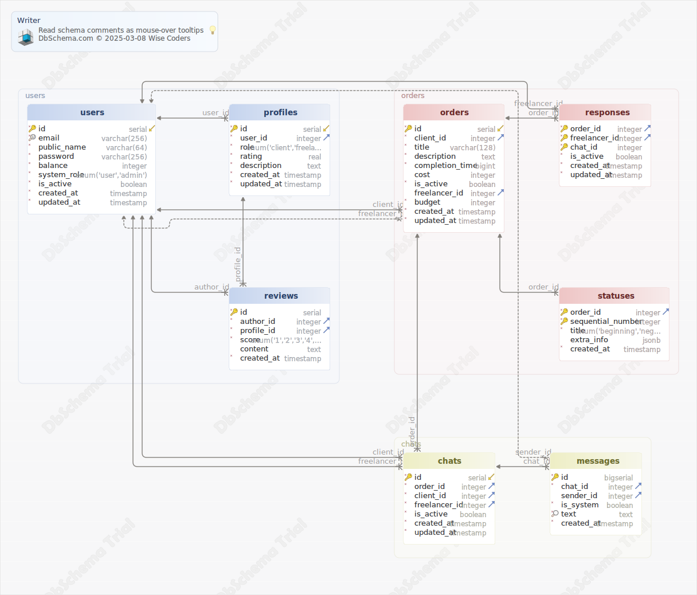

# Диаграмма
Generated using [DbSchema](https://dbschema.com)

### Схема

### chats
Переписки.

| Idx                   | Name           | Data Type                            | Description                                                           |
|-----------------------|----------------|--------------------------------------|-----------------------------------------------------------------------|
| * &#128273;  &#11019; | id             | serial                               | ID переписки.                                                         |
| * &#11016;            | order\_id      | integer                              | ID заказа, в рамках которого ведётся переписка.                       |
| * &#11016;            | client\_id     | integer                              | ID пользователя, выступающего в роли заказчика.                       |
| * &#11016;            | freelancer\_id | integer                              | ID пользователя, выступающего в роли исполнителя.                     |
| *                     | is\_active     | boolean  DEFAULT true                | Является ли переписка активной (можно ли отправлять новые сообщения). |
| *                     | created\_at    | timestamp  DEFAULT CURRENT_TIMESTAMP | Дата создания записи.                                                 |
| *                     | updated\_at    | timestamp  DEFAULT CURRENT_TIMESTAMP | Дата обновления записи.                                               |

##### Индексы 
| Type      | Name      | On    |
|-----------|-----------|-------|
| &#128273; | pk\_chats | ON id |

##### Внешние ключи
| Type | Name             | On                                          |
|------|------------------|---------------------------------------------|
|      | fk_chats_users   | ( client\_id ) ref [users](#users) (id)     |
|      | fk_chats_users_1 | ( freelancer\_id ) ref [users](#users) (id) |
|      | fk_chats_orders  | ( order\_id ) ref [orders](#orders) (id)    |

### messages
Сообщения в переписке.

| Idx         | Name        | Data Type                            | Description                                                                              |
|-------------|-------------|--------------------------------------|------------------------------------------------------------------------------------------|
| * &#128273; | id          | bigserial                            | ID сообщения (при потоке в 1 млн. сообщений в секунду должно хватить на 292 тысячи лет). |
| * &#11016;  | chat\_id    | integer                              | ID переписки, к которой относится сообщение.                                             |
| &#11016;    | sender\_id  | integer                              | ID отправителя сообщения (может быть NULL), если сообщение системное.                    |
| *           | is\_system  | boolean  DEFAULT false               | Является ли сообщение системным (системные сообщения должны отрисовываться по другому).  |
| * &#128270; | text        | text                                 | Текст сообщения.                                                                         |
| *           | created\_at | timestamp  DEFAULT CURRENT_TIMESTAMP | Дата создания записи.                                                                    |

##### Индексы 
| Type      | Name          | On      |
|-----------|---------------|---------|
| &#128273; | pk\_messages  | ON id   |
| &#128270; | idx\_messages | ON text |

##### Внешние ключи
| Type | Name              | On                                      |
|------|-------------------|-----------------------------------------|
|      | fk_messages_chats | ( chat\_id ) ref [chats](#chats) (id)   |
|      | fk_messages_users | ( sender\_id ) ref [users](#users) (id) |

### orders
Заказы.

| Idx                   | Name             | Data Type                            | Description                                                                                                                            |
|-----------------------|------------------|--------------------------------------|----------------------------------------------------------------------------------------------------------------------------------------|
| * &#128273;  &#11019; | id               | serial                               | ID заказа.                                                                                                                             |
| * &#11016;            | client\_id       | integer                              | ID пользователя, разместившего заказ.                                                                                                  |
| *                     | title            | varchar(128)                         | Название заказа.                                                                                                                       |
| *                     | description      | text                                 | Описание заказа, которое задаётся пользователем.                                                                                       |
| *                     | completion\_time | bigint                               | Время, отведённое на выполнение заказа в наносекундах. Максимум при использовании int64 - 292 года.                                    |
|                       | cost             | integer                              | Стоимость заказа. Если NULL - считать стоимость договорной. Используется только для показа в карточке заказа и никогда - для расчётов. |
| *                     | is\_active       | boolean  DEFAULT true                | Активен ли заказ (может быть неактивен, если заказ был скрыт администратором или удалён заказчиком).                                   |
| &#11016;              | freelancer\_id   | integer  DEFAULT NULL                | ID выбранного исполнителя. Пока исполнитель не выбран, равен NULL.                                                                     |
| *                     | budget           | integer  DEFAULT 0                   | Бюджет сделки, который резервируется в качестве гарантии оплаты услуг исполнителя. Может отличаться от cost.                           |
| *                     | created\_at      | timestamp  DEFAULT CURRENT_TIMESTAMP | Дата создания записи.                                                                                                                  |
| *                     | updated\_at      | timestamp  DEFAULT CURRENT_TIMESTAMP | Дата обновления записи.                                                                                                                |

##### Индексы 
| Type      | Name       | On    |
|-----------|------------|-------|
| &#128273; | pk\_orders | ON id |

##### Внешние ключи
| Type | Name              | On                                          |
|------|-------------------|---------------------------------------------|
|      | fk_orders_users   | ( client\_id ) ref [users](#users) (id)     |
|      | fk_orders_users_1 | ( freelancer\_id ) ref [users](#users) (id) |

### profiles
Профили пользователей.

| Idx                   | Name        | Data Type                            | Description                          |
|-----------------------|-------------|--------------------------------------|--------------------------------------|
| * &#128273;  &#11019; | id          | serial                               | ID профиля.                          |
| * &#11016;            | user\_id    | integer                              | ID владельца профиля.                |
| *                     | role        | enum('client','freelancer')          | Роль (заказчик или исполнитель).     |
| *                     | rating      | real  DEFAULT 0                      | Рейтинг профиля, основан на отзывах. |
| *                     | description | text                                 | Пользовательское поле "О себе".      |
| *                     | created\_at | timestamp  DEFAULT CURRENT_TIMESTAMP | Дата создания записи.                |
| *                     | updated\_at | timestamp  DEFAULT CURRENT_TIMESTAMP | Дата обновления записи.              |

##### Индексы 
| Type      | Name         | On    |
|-----------|--------------|-------|
| &#128273; | pk\_profiles | ON id |

##### Внешние ключи
| Type | Name              | On                                    |
|------|-------------------|---------------------------------------|
|      | fk_profiles_users | ( user\_id ) ref [users](#users) (id) |

### responses
Отклики исполнителей на заказы.

| Idx                   | Name           | Data Type                            | Description                                       |
|-----------------------|----------------|--------------------------------------|---------------------------------------------------|
| * &#128273;  &#11016; | order\_id      | integer                              | ID заказа, на который оставлен отклик.            |
| * &#128273;  &#11016; | freelancer\_id | integer                              | ID пользователя, оставившего отклик.              |
| * &#128273;           | chat\_id       | integer                              | ID переписки (чата), созданного в рамках отклика. |
| *                     | is\_active     | boolean  DEFAULT true                | Активен ли отклик.                                |
| *                     | created\_at    | timestamp  DEFAULT CURRENT_TIMESTAMP | Дата создания записи.                             |
| *                     | updated\_at    | timestamp  DEFAULT CURRENT_TIMESTAMP | Дата редактирования записи.                       |

##### Индексы 
| Type      | Name          | On                                     |
|-----------|---------------|----------------------------------------|
| &#128273; | pk\_responses | ON order\_id, freelancer\_id, chat\_id |

##### Внешние ключи
| Type | Name                | On                                          |
|------|---------------------|---------------------------------------------|
|      | fk_responses_users  | ( freelancer\_id ) ref [users](#users) (id) |
|      | fk_responses_orders | ( order\_id ) ref [orders](#orders) (id)    |

### reviews
Отзывы пользователей.

| Idx         | Name        | Data Type                            | Description                            |
|-------------|-------------|--------------------------------------|----------------------------------------|
| * &#128273; | id          | serial                               | ID отзыва.                             |
| * &#11016;  | author\_id  | integer                              | ID пользователя, оставившего отзыв.    |
| * &#11016;  | profile\_id | integer                              | ID профиля, на который оставлен отзыв. |
| *           | score       | enum('1','2','3','4','5')            | Оценка (от 1 до 5).                    |
|             | content     | text                                 | Текст отзыва.                          |
| *           | created\_at | timestamp  DEFAULT CURRENT_TIMESTAMP | Дата создания записи.                  |

##### Индексы 
| Type      | Name        | On    |
|-----------|-------------|-------|
| &#128273; | pk\_reviews | ON id |

##### Внешние ключи
| Type | Name                | On                                             |
|------|---------------------|------------------------------------------------|
|      | fk_reviews_users    | ( author\_id ) ref [users](#users) (id)        |
|      | fk_reviews_profiles | ( profile\_id ) ref [profiles](#profiles) (id) |

### statuses 
История изменения статусов заказов.

| Idx                   | Name               | Data Type                                                                                              | Description                                      |
|-----------------------|--------------------|--------------------------------------------------------------------------------------------------------|--------------------------------------------------|
| * &#128273;  &#11016; | order\_id          | integer                                                                                                | ID заказа, для которого присвоен статус.         |
| * &#128273;           | sequential\_number | integer                                                                                                | Порядковый номер статуса по порядку.             |
| *                     | title              | enum('beginning','negotiation','budgeting','work','reviews','finished','dispute')  DEFAULT 'beginning' | Название статуса.                                |
|                       | extra\_info        | jsonb                                                                                                  | Дополнительная информация о статусе, если нужно. |
| *                     | created\_at        | timestamp  DEFAULT CURRENT_TIMESTAMP                                                                   | Дата создания записи.                            |

##### Индексы 
| Type      | Name         | On                               |
|-----------|--------------|----------------------------------|
| &#128273; | pk\_statuses | ON order\_id, sequential\_number |

##### Внешние ключи
| Type | Name               | On                                       |
|------|--------------------|------------------------------------------|
|      | fk_statuses_orders | ( order\_id ) ref [orders](#orders) (id) |

### users
Таблица пользователей.

| Idx                   | Name         | Data Type                            | Description                                                                                                                                         |
|-----------------------|--------------|--------------------------------------|-----------------------------------------------------------------------------------------------------------------------------------------------------|
| * &#128273;  &#11019; | id           | serial                               | ID пользователя.                                                                                                                                    |
| * &#128269;           | email        | varchar(256)                         | Электронная почта пользователя, должна быть уникальной.                                                                                             |
| *                     | public\_name | varchar(64)                          | Публичное имя пользователя (ФИО или ФИ).                                                                                                            |
| *                     | password     | varchar(256)                         | Пароль в захэшированном виде.                                                                                                                       |
| *                     | balance      | integer  DEFAULT 0                   | Количество средств на счету у пользователя.                                                                                                         |
| *                     | system\_role | enum('user','admin')  DEFAULT 'user' | Системная роль (пользователь, администратор, модератор и т.п.). Определяет возможность пользователя авторизоваться и попасть на служебные страницы. |
| *                     | is\_active   | boolean  DEFAULT true                | Активен ли аккаунт пользователя в данный момент.                                                                                                    |
| *                     | created\_at  | timestamp  DEFAULT CURRENT_TIMESTAMP | Дата создания записи.                                                                                                                               |
| *                     | updated\_at  | timestamp  DEFAULT CURRENT_TIMESTAMP | Дата обновления документа.                                                                                                                          |

##### Indexes 
| Type      | Name       | On       |
|-----------|------------|----------|
| &#128273; | pk\_users  | ON id    |
| &#128269; | unq\_users | ON email |
